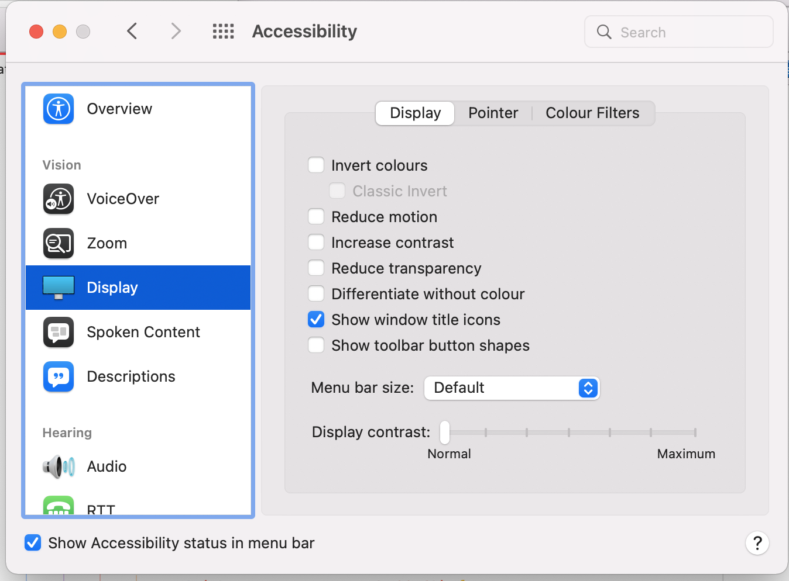

macOS specific stuff
====================

Enable Touch ID for `sudo`
--------------------------

1. `sudo vim /etc/pam.d/sudo`
2. add `auth sufficient pam_tid.so` to the top
3. `:w!` followed by `:q`
4. `sudo` commands in new prompts now request Touch ID before password

Enable proxy icons (macOS 12)
-----------------------------

1. Open System Settings
2. Navigate to Accessibility -> Display
3. Tick on "Show window title icons"

Edit Xcode Built-in Snippets
----------------------------

`/Applications/Xcode.app/Contents/PlugIns/IDESourceEditor.framework/Versions/A/Resources`
